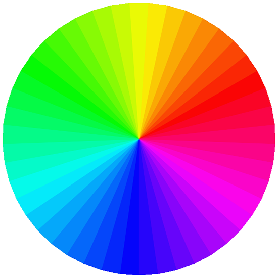

In this exercise we will create a colour wheel which displays
different HSB values depending on where the mouse is or
the amount of angles that are in the circle.

We will be using the beginShape endShape functionality to
create the wheel of colours.

We will also make more use of of the keyPressed function
by changing the structure the colour wheel by simply pressing a key.

