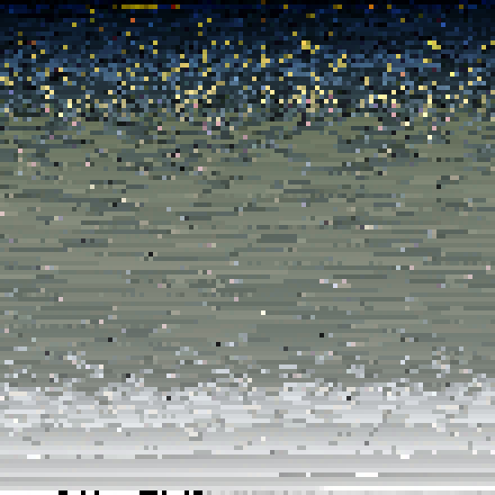

## Colour palettes from images

In this exercise we work on exporting various colour palettes
from images. Breaking images down to there base pixels and displaying
them as rectangles on the canvas.

We also explore in changing the sortmode of each image. Sorting it by
Hue, Saturation, Brightness and Greyscale.



```js

'use strict';

var img;
var colors = [];
var sortMode = null;

//load image
function preload() {
  img = loadImage('data/pic1.jpg');
}

function setup() {
  createCanvas(600, 600);
  noCursor();
  noStroke();
}

//Setting tileCount to the width of the cavas, divided by the
//max value between the mouseX position and 5
function draw() {
  var tileCount = floor(width / max(mouseX, 5));
  var rectSize = width / tileCount;

//Displays image
  img.loadPixels();
  colors = [];

//Now the image is being scanned row by row with the
//previously calculated grid spacing
  for (var gridY = 0; gridY < tileCount; gridY++) {
    for (var gridX = 0; gridX < tileCount; gridX++) {
      var px = int(gridX * rectSize);
      var py = int(gridY * rectSize);
      var i = (py * img.width + px) * 4;
      var c = color(img.pixels[i], img.pixels[i + 1], img.pixels[i + 2], img.pixels[i + 3]);
      colors.push(c);
    }
  }
//When sortMode is selected the colours are sorted using the function sortColors()
  gd.sortColors(colors, sortMode);

  var i = 0;
  for (var gridY = 0; gridY < tileCount; gridY++) {
    for (var gridX = 0; gridX < tileCount; gridX++) {
//Grid is processed again in order to draw the palette.
//The fill colours for the tiles are taken, value by value, from the array colours
      fill(colors[i]);
      rect(gridX * rectSize, gridY * rectSize, rectSize, rectSize);
      i++;
    }
  }
}
//keys 1-4 to load various images
// keys 5-9 used to sort image by hue, saturation, brightness and grayscale.
function keyReleased() {
  if (key == 'c' || key == 'C') writeFile([gd.ase.encode(colors)], gd.timestamp(), 'ase');
  if (key == 's' || key == 'S') saveCanvas(gd.timestamp(), 'png');

  if (key == '1') img = loadImage('data/pic1.jpg');
  if (key == '2') img = loadImage('data/pic2.jpg');
  if (key == '3') img = loadImage('data/pic3.jpg');
  if (key == '4') img = loadImage('data/pic4.jpg');

  if (key == '5') sortMode = null;
  if (key == '6') sortMode = gd.HUE;
  if (key == '7') sortMode = gd.SATURATION;
  if (key == '8') sortMode = gd.BRIGHTNESS;
  if (key == '9') sortMode = gd.GRAYSCALE;
}


```
