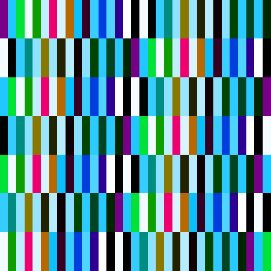

## Colour palettes from rules

Here we explore a bit more into the hue, saturation and brightness of
colours. How the values for these colour components are defined by a set of rules.

Using controlled randomness, it is more simple and quick to create difference
palettes in specific colour nuances.
